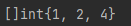

# Go基础语法

## 第一个Go程序

```go
package main

import "fmt"

func main(){
    fmt.Println("Hello World!")
}
```

* 只有在main包下的`main`函数才能运行

* 使用import导入包

  * 使用import导入单个包

    ```go
    import "package"
    ```

  * 使用import导入多个包

    ```go
    import (
        "package1"
        "package2"
    )
    ```

  * 使用import导入包，但是**包中的方法不使用**时编译会报错

    

  * 需要使用包的init函数，但是不使用包中的方法，使用`_`在包前，表示匿名导入，只需要包的init函数

    ```go
    import  _"fmt"
    ```

    

* `package`可以和文件夹不同名

* 在同一文件夹的.go文件需要属于同一个`package`，不然会报错

  


* `{}`要和函数名放在一行，否者会报错(golang的格式检查非常严格)

  

* `func`关键字，用于定义一个方法

## Go语言的字符串

```go
package main

import "unicode/utf8"

func main(){
    println(len("你好"))//输出6
    println(utf8.RuneCountInString("你好"))//输出2
    println(utf8.RuneCountInString("你好ab"))//输出4
    
    var a string = "Hello"
	var b string = "World"
	var ab string = a + "," + b
    println(ab)//输出"Hello,World
    var c int = 10
	var ac string = a + c //会报错，因为c不是字符串类型的
}
```

* Go语言中string的长度很特殊

  * 字节长度：和编码无关，使用len(str)获取的是
  * 字符数量：和编码有关，用编码库来计算

* Go语言中字符串的拼接

  * 和其他语言一样的是，都是使用`+`来拼接两个字符串

  * 和其他语言不一样的是，Go不会帮你做这种类型转换,string类型的只能和string类型的拼接，和其他类型的拼接会报错

    


* Go中关于string的操作都放在strings这个包中，例如切割、查找...等

## Go语言中的rune类型

```go
// rune is an alias for int32 and is equivalent to int32 in all ways. It is
// used, by convention, to distinguish character values from integer values.
type rune = int32

//这是标准库中的定义
```

* `rune`，直观理解，就是字符
* `rune`不是byte
* `rune`本质是int32,一个`rune`四个字节
* `rune`在其他很多语言里面是没有的，与之对应的，golang没有char类型。`rune`不是数字，也不是char，也不是byte
* 一般这个类型用的很少

## Go语言中的数字类型

* bool:true,false
* int8,int16,int32,int64,int
  * golang中没有long，long long这种长整型,它直接将整形的位数表示在int后面，需要那种类型直接定义就好
* uint8,uint16,uint32,uint64,uint
  * 这是golang中的无符号整形
* float32,float64
  * 同样的,golang中也没有double这种类型，是将类型占用的位数接在类型后面来表示的

## Go语言中的byte类型

```go
// byte is an alias for uint8 and is equivalent to uint8 in all ways. It is
// used, by convention, to distinguish byte values from 8-bit unsigned
// integer values.
type byte = uint8

//标准库中对byte的定义
```

* `byte`本质是`unit8`，占8位，表示一个字节
* `byte`类型的相应操作在`bytes`包中

## Golang类型总结

* golang的数字类型标注了长度、有无符号
* golang不会帮你做类型转换，类型不同无法通过编译。因此`string`也只能和`string`拼接
* golang中有一个很特殊的`rune`类型，接近一般语言的char或者character的概念
* `string`,`byte`对应的操作都在`strings`和`bytes`包中

***


## Golang中变量的声明和定义

```go
package main

var Global string
var local string
var (
	a int
	b string
)

func main() {
    c:=13 //简短变量声明
}
```

* golang中使用变量首字符的大小写来控制变量的可访问性

  * 首字母大写代表全局变量，包外可访问
  * 首字母小写代表局部变量，仅包内可访问

* 多组变量声明使用，如下形式

  ```go
  var (
      var1 type
      var2 type
  )
  ```

* golang有类型推断机制，在有初始化值的情况下某些变量可以省略掉类型

  ```go
  var First="First"
  var Second=2
  
  var c uint=15 //unit类型不能省略类型，因为golang会把数字推断为int类型
  ```

* golang是一个非常强类型的语言，不会做任何类型转换

  ```go
  var a uint=15
  var b=10
  
  println(a==b) //编译会报错，因为a和b不是同类型的，不会转换
  ```

* 使用`:=`声明变量,只能在函数内部声明使用，在函数外面声明会报错

  

## Golang中常量的声明和定义

* 常量声明和定义的方式和变量一样，只是将关键字var换成了`const`

* 无类型常量

  ```go
  type myInt int
  const n myInt = 13
  const m int = n + 5 // 编译器报错：cannot use n + 5 (type myInt) as type int in const initializer
  
  func main() {
      var a int = 5
      fmt.Println(a + n) // 编译器报错：invalid operation: a + n (mismatched types int and myInt)
  }
  ```

  ```go
  type myInt int
  const n = 13
  
  func main() {
      var a myInt = 5
      fmt.Println(a + n)  // 输出：18
  }
  ```

  * Go 编译器会自动将 a+n 这个表达式中的常量 n 转型为 myInt 类型，再与变量 a 相加。由于变量 a 的类型 myInt 的底层类型也是 int，所以这个隐式转型不会有任何问题。

  > 对于无类型常量参与的表达式求值，Go 编译器会根据上下文中的类型信息，把无类型常量自动转换为相应的类型后，再参与求值计算，这一转型动作是隐式进行的。但由于转型的对象是一个常量，所以这并不会引发类型安全问题，Go 编译器会保证这一转型的安全性。

  * 不过，如果 Go 编译器在做隐式转型时，发现无法将常量转换为目标类型，Go 编译器也会报错，比如下面的代码就是这样：

    ```go
    const m = 1333333333
    
    var k int8 = 1
    j := k + m // 编译器报错：constant 1333333333 overflows int8
    ```

  * 这个代码中常量 m 的值 1333333333 已经超出了 int8 类型可以表示的范围，所以我们将它转换为 int8 类型时，就会导致编译器报溢出错误。

## 实现枚举

* Go没有提供原生的枚举类型

* Go 的 const 语法提供了“隐式重复前一个非空表达式”的机制

  ```go
  package main
  import "fmt"
  
  const (
  	Apple, Banana = 11, 22
  	Strawberry, Grape
  	Pear, Watermelon
  )
  
  func main() {
  	fmt.Printf("Apple:%d\n", Apple)
  	fmt.Printf("Banana:%d\n", Banana)
  	fmt.Printf("Strawberry:%d\n", Strawberry)
  	fmt.Printf("Grape:%d\n", Grape)
  	fmt.Printf("Pear:%d\n", Pear)
  	fmt.Printf("Watermelon:%d\n", Watermelon)
  }
  
  ```

  

  

* Go 在这个特性的基础上又提供了“神器”：iota

  ```go
  const (
  	mutexLocked = iota
  	mutexWoken
  	mutexStarving
  	mutexWaiterShift      = iota//结束偏移
  	starvationThresholdNs = 1e6
  )
  
  func main() {
  	fmt.Printf("mutexLocked:%d\n", mutexLocked)
  	fmt.Printf("mutexWoken:%d\n", mutexWoken)
  	fmt.Printf("mutexStarving:%d\n", mutexStarving)
  	fmt.Printf("mutexWaiterShift:%d\n", mutexWaiterShift)
  	fmt.Printf("starvationThresholdNs:%e\n", starvationThresholdNs)
  }
  ```

  

  > `iota`是一个从0开始的偏移值，每偏移一行+1
  >
  > 注意：位于同一行的`iota`即便出现多次，多个iota的值也是一样的

  ```go
  package main
  
  import "fmt"
  
  const (
  	Apple, Banana     = iota, iota + 10 // 0, 10 (iota = 0)
  	Strawberry, Grape                   // 1, 11 (iota = 1)
  	Pear, Watermelon                    // 2, 12 (iota = 2)
  )
  
  func main() {
  	fmt.Printf("Apple:%d ", Apple)
  	fmt.Printf("Banana:%d\n", Banana)
  	fmt.Printf("Strawberry:%d ", Strawberry)
  	fmt.Printf("Grape:%d\n", Grape)
  	fmt.Printf("Pear:%d ", Pear)
  	fmt.Printf("Watermelon:%d\n", Watermelon)
  }
  
  ```

  

  * 略过某些不想要的值，用`_`占位即可

    ```go
    const (
        _ = iota // 0
        Pin1
        Pin2
        Pin3
        _
        Pin5    // 5   
    )
    ```

    

  

***

## Golang方法定义

```go
func FuncName(arg1 arg1type,arg2 arg2type) returnType{
    
}

func FuncName2(arg1 arg1type,arg2 arg2type) (returnType1,returnType2){
    return returnValue1,returnValue2
}//多返回值函数定义
```

* golang方法的定义使用如上格式定义

* golang方法支持多返回值

* 使用多个变量接收多返回值，如果不想接收某个变量可以使用`_`来省略该值

  ```go
  package main
  
  func ReturnTwo() (int, int) {
  	return 1, 2
  }
  func main() {
  	a, b := ReturnTwo()
  	println(a, b)
  	_, c := ReturnTwo()
  	println(c)
  }
  ```

* golang还支持命名返回值(**一般还是不命名，不符合大多数的使用习惯，但是要知道**)

  ```go
  func ReturnTwo() (r1 int,r2 int) {
  	r1=1
      r2=2
      return
  }
  ```

* golang还支持不定参数(使用不定参数时，要将不定参数放在最后，当做最后一个参数)

  ```go
  func Func4(a string,b int,names ...string){
      for _,name:=range names{
          //将不定参数当做切片使用即可
          println(name)
      }
  }
  ```

***

## Go中的数组和切片

### 数组

```go
package main

func main(){
    a1:=[3]int{9,8,7}
    var a2 [3]int
    var a3 [3]int ={0,0,0}
}
```

* 数组定义定义的语法是: [cap]type
* 初始化要指定容量
* 数组会直接初始化，如果你没有手动初始化的话，go会自动帮你把数组中的值初始化为0
* go数组创建好之后，内存就已经分配好了(不能更改)
* 数组中len==cap

### 切片

```go
package main

func main(){
    a1:=[]int{1,2,3}
    var a2 []int
    s1:=make([]int,3,4)//创建一个有三个元素的，但是容量是4的切片
    s2:=make([]int,4)//等价于make([]int,4,4)
    s1=append(s1,5)
}
```

* 切片的定义方法和数组类似，但是不指定空间的大小

* 切片的len<=cap ,cap >=len，和数组不一样

* 向切片里添加一个元素使用append

  ```go
  package main
  import "fmt"
  func main() {
  	s1 := make([]int, 3, 4)
  	s1 = append(s1, 5)
  	fmt.Printf("s1:%v s1.len:%d s1.cap:%d/n", s1, len(s1), cap(s1))
      //添加元素后没超出容量不会触发扩容
  	s1 = append(s1, 6)
  	fmt.Printf("s1:%v s1.len:%d s1.cap:%d/n", s1, len(s1), cap(s1))
      ///添加元素后超出容量后会触发扩容机制
  }
  ```

  

* 推荐写法 s1:=make([]type,0,capacity)

### 子切片

```go
package main

func main(){
    s1:=[]int{2,4,6,8}
    s2:=s1[1:3] //获得[start,end)之间的元素，左闭右开
    s3:=s1[:3]  //获得[0:end)之间的元素
    s4:=s1[0:]  //获得[start,end)之间的元素
    s5:=s1[:]   //获得该切片的全部元素
}
```

* 注意切片是左闭右开的区间就可以了

### 如何理解切片

* 切片的操作很有限，不支持随机的增删，没有add和delete方法

* 只有append操作

* 切片支持子切片操作(子切片和原本切片共用一个底层数组)

  * 子切片和切片是否会互相影响，根据它们是否还共享数组

    * 如果子切片或者原本切片的结构发生变化了，它们就不共享同一个数组了(**结构发生变化了就是扩容了，扩容之后会将原数组的数据拷贝到新开辟的数组，这样子切片和原切片就不共享同一个数组了，就不会互相影响了**)

      ```go
      package main
      
      import "fmt"
      
      func main() {
      	s1 := make([]int, 3, 3)
      	s2 := s1[0:3]
      	println("修改S2前")
      	fmt.Printf("s1:%p s1:%v \n s2:%p,s2:%v/n", s1, s1, s2, s2)
      	s2[0] = 1
      	println("修改S2后")
      	fmt.Printf("s1:%p s1:%v \n s2:%p,s2:%v/n", s1, s1, s2, s2)
      	println("S1扩容:修改S2前")
      	s1 = append(s1, 3)
      	fmt.Printf("s1:%p s1:%v \n s2:%p,s2:%v/n", s1, s1, s2, s2)
      	println("S1扩容:修改S2后")
      	s2[1] = 2
      	fmt.Printf("s1:%p s1:%v \n s2:%p,s2:%v/n", s1, s1, s2, s2)
      }
      ```

      

    * 可以看到，扩容之前，s1和s2指向的是同一块内存地址，所以他们会互相影响，但是扩容之后，s1和s2就指向不同的内存地址了，就不会再互相影响了

* **注意：**用子切片，只是用来**只读**，不要修改里面的值

* 直接声明的切片和make出来的空切片的区别

  * 直接声明出来的切片，没有分配内存地址，是`nil`

  * make出来的，已经分配好了内存空间

    ```go
    func main() {
    	var sl1 []int
    	var sl2 = []int{}
    	fmt.Printf("s1:%p \ns2:%p", sl1, sl2)
    }
    ```

    

* Go中切片是引用类型,不用传指针也能修改切片中的值

  ```go
  func test(slice []int) {
  	slice[2] = 4
  }
  func main() {
  	s1 := []int{1, 2, 3}
  	test(s1)
  	fmt.Printf("%#v", s1)
  }
  ```

  

 ###  数组和切片的对比

|            |    数组    |     切片     |
| :--------: | :--------: | :----------: |
| 直接初始化 |    支持    |     支持     |
|    make    | **不支持** |     支持     |
|  访问元素  |   arr[i]   |    arr[i]    |
|    len     |    长度    | 已有元素个数 |
|    cap     |    长度    |     容量     |
|   append   | **不支持** |     支持     |
| 是否可扩容 | **不可以** |     可以     |

***

## 控制结构

### for

```go
package main

func main(){
    for true{
        
    }//无限循环,true加不加无所谓
    for i:=0;i<10;i++{
        
    }//标准for循环
    arr := []int{1,2,3,4}
    for index,value:=range arr{
        
    }
    M:=map[string]string{"test":"just is a test"}
    for k,v:=range M{
        
    }
    delete(M,"test")
}
```

* golang中没有while循环，无限循环上述第一种格式

* 使用for...range这种格式的for循环，可以用于数组、切片和map,对于数组和可以直接拿到index和value，对于map可以直接拿到key和value

  * 如果不想要index或者key可以用`_`来不接收

    ```go
        arr := []int{1,2,3,4}
        for _,value:=range arr{
            
        }
        M:=map[string]string{"test":"just is a test"}
        for _,v:=range M{
            
        }
    ```
  
* 使用`delete`删除map中的某个值

### if-else

```go
package main

func main(){
    a:=10
    if a<100{
        
    }else{
        
    }//普通for
    if i:=10;a==i{
        
    }else{
        
    }//先定义一个变量(也可以是表达式)，再判断
    i:=10;
    if a==i{
        
    }else{
        
    }//和上述的一样
}
```

* 使用if i:=10;a==i...,这种格式的`if`时
  * `i`只能在if的作用域使用，出了`if`的作用域就不能使用了

### switch

```go	
package main

func main(){
    a:=10
    switch a{
    case 10:
        doSomething...
     case 20:
        doSomething...
     default:
        doSomething...
    }
}
```

* golang中`switch`和其他语言大体差不多，但是`case`后面不用加`break`了,它执行完一个case里面的语句后会自动跳出，不会执行后续语句，如果想让它执行后续语句可以用一个关键字`fallthrough`

  ```go
  package main
  
  func main(){
      a:=10
      switch a{
      case 10:
          doSomething...
          fallthrough//使用该关键字后，后面所有的case包括default都会执行
       case 20:
          doSomething...
       default:
          doSomething...
      }
  }
  ```

* `switch`后面可以是基础类型和字符串，或者满足特定条件的结构体

  ```go
  package main
  type user struct{
      name string
  }
  func main{
      u:=user
      switch u{
      default:
      }
  }
  ```

## 基础语法type定义

### interface定义

```go
package main

import "net/http"

type Server interface {
	Route(pattern string, handleFunc http.HandlerFunc)
	Start(address string) error
}
```

* 接口的可访问性还是用首字母是否大小写控制
* 接口中的方法声明不需要使用`func`关键字
* 接口是一组行为的抽象
* 尽量用接口，以实现面向接口编程

### struct定义

```go
package main
type sdkHttpServer struct {
	name string
    age int
}

func main(){
    s1:=&sdkHttpServer{}
    s2:=new(sdkHttpServer)
    s3:=sdkHttpServer{}
    var s4 sdkHttpServer =sdkHttpServer{}
    //以上四种初始化，是将内存空间给你分配好，并将所有比特位置为0
    //go中没有构造函数
    var s5 *sdkHttpServer //不会初始化好，是一个指针，指针还没指向任何地方
    
    s6:=sdkHttpServer{"zs",18} //初始化按照字段声明顺序赋值
    s7:=sdkHttpServer{
        name:"ls",
        age:18,
    }//显式表示每一个字段，进行赋值
    s8:=sdkHttpServer{}
    s8.name="张三"
}
```

* Go中结构体也有内存对齐

### 嵌入字段

```go

type Book struct {
    Title string
    Person
    ... ...
}
```

* 我们可以无需提供字段的名字，只需要使用其类型就可以了

### 指针

* 和C与C++的指针一样，但是没有`->`操作符解引用结构体

* 结构体要在自己的结构体中自引用要使用指针，否则会报错

  * 原因是因为指针的大小是固定的，在分配时可以确定大小，如果是一个正常的struct类型，就会陷入无限递归这种境地，**无法计算大小**

    ```go
    type Node struct{
        data int
        //next Node,会报错
        next *Node
    }
    ```

### 结构体方法

```go
package main

type User struct {
	name string
	age  int
}

func (u User) ChangeName(str string) {
	u.name = str
} //结构体接收器，不能直接调用，需要实例化一个结构体来调用
func (u *User) ChangeAge(Age int) {
	u.age = Age
} //指针接收器
func main() {
	u := User{
		name: "Tom",
		age:  10,
	}
	u.ChangeName("Changed")
	u.ChangeAge(20)
	println(u.name, u.age)
	up := &User{
		name: "Jerry",
		age:  12,
	}
	up.ChangeName("Changed")
	up.ChangeAge(100)
	println(up.name, up.age)
}

```

* 结构体接收器接收的是实例的拷贝，在该方法中对结构体进行更改，不会影响原结构体，但是使用指针接收器就可以改变原结构体。

  

  可以发现年龄都改成功了，但是名字都没有改成功

### type A B 和type A=B

```go
package main

import "fmt"

type MyInt1 int
type MyInt2 = int

type Fish struct {
}

func (F *Fish) Swim() {
	fmt.Println("Fish is swimming/n")
}

type FakeFish Fish

func (FF *FakeFish) FakeFishSwim() {
	fmt.Println("FakeFish is swimming/n")
}

type StrongFakeFish Fish

func (SFF *StrongFakeFish) Swim() {
	fmt.Println("StrongFakeFish is swimming/n")
}

type RealFish = Fish

func main() {
	var m1 MyInt1 = 10
	var m2 MyInt2 = 10
	fmt.Printf("m1 type:%T \nm2 type:%T/n", m1, m2)
	F := Fish{}
	F.Swim()
	FF := FakeFish{}
	println("FakeFish 转换前调用FakeFishSwim方法")
    //FF.Swim()   会报错，因为FakeFish是一个全新的类型，并没有定义Swim方法
 	FF.FakeFishSwim()
	td := Fish(FF)
	println("将FakeFish转换成Fish后调用Swim方法")
	td.Swim()
	FFS := StrongFakeFish{}
	println("StrongFakeFish调用Swim方法")
	FFS.Swim()
	ts := Fish(FFS)
	println("StrongFakeFish转换成Fish后调用Swim方法")
	ts.Swim()
	println("RealFish直接调用Swim方法")
	RS := RealFish{}
	RS.Swim()
}
```

* type A B 是定义了一种全新的类型A，type A=B是给B类型取了个别名

  * 在编译时使用type A=B取得别名A会被还原成B类型

    

  * 使用type A B定义一个全新类型A，A不能直接调用B的方法，直接调用会报错，但是将A转换成B类型就可以调用B类型的方法了

    

  * 使用type A B定义全新类型时，当A 和B定义了同名方法时，实例化出来的对象是什么类型就调用什么类型的方法 是A类型就调用A类型的该方法，是B类型就调用B类型的该方法，如果将A转换成B类型，就调用B类型的方法

    

  * 使用type A=B方式取得别名A可以调用B类型的方法，因为在编译时会将A还原成B类型，在编译器看来他们是同一种类型

    

### 结构体定义接口

* 当一个结构体具备这个接口的所有方法的时候，它就实现了这个接口

### type总结

* type定义熟记，其中type A=B这种别名，一般只用于兼容性处理，所以不需要过多关注
  * 先有抽象再实现，所以要先定义接口
* 鸭子类型：一个结构体具有某个接口的所有方法，它就实现了这个接口
* 指针：方法接收器，遇事不决用指针

## 空接口interface{}

```go
func (c *Context) ReadJson(req interface{}) error {
	//读出body 处理Json 反序列化
	r := c.R
	body, err := io.ReadAll(r.Body)
	if err != nil {
		return err
	}
	err = json.Unmarshal(body, req)
	if err != nil {
		return err
	}
	return nil
}
```

* 空接口不包含任何方法，所以任何结构体都实现了该接口(万能接口，所有参数都能接收)

## map

```go
package main

func main(){
    m:=make(map[string]string,2)//创建一个预估容量为2的map
    m1:=map[string]string{
        "test":"this is a test"
    }//直接初始化(复合字面量指定初始化)
    m2:=make(map[string]string)//没有指定容量
    m["hello"]="world"
    
    val:=m["hello"] //取值
    
    val,ok:=m["no"]
    if !ok{
        
    }
    for key,val:=range m{
        
    }
    delete(map,"test")//map中数据的删除
}
```

* map和其他语言的map使用方法基本一样

* Go 语言中要求，key 的类型必须支持“==”和“!=”两种比较操作符。

* map取值时有两个返回值，第一个返回值是就是map[key]的value，第二个值返回是否成功取到该值，也就是该key，value是否存在于该map

* 使用for...range语法遍历map时，第一个值是key第二个值是value，前面讲for循环的时候提过了(注意，**map的遍历，顺序是不确定的**)

* 函数类型、map 类型自身，以及切片类型是不能作为 map 的 key 类型的。

* map是引用类型

  * 这就意味着 map 类型变量作为参数被传递给函数或方法的时候，实质上传递的只是一个“描述符”，而不是整个 map 的数据拷贝，所以这个传递的开销是固定的，而且也很小。

* map的内部实现

  * Go 运行时使用一张哈希表来实现抽象的 map 类型。运行时实现了 map 类型操作的所有功能，包括查找、插入、删除等。在编译阶段，Go 编译器会将 Go 语法层面的 map 操作，重写成运行时对应的函数调用。

    

  * 与语法层面 map 类型变量（m）一一对应的是 *runtime.hmap 的实例，即 runtime.hmap 类型的指针,也就是 map 类型变量传递开销时提到的 map 类型的描述符。

  * 当我们向 map 插入一条数据，或者是从 map 按 key 查询数据的时候，运行时都会使用哈希函数对 key 做哈希运算，并获得一个哈希值（hashcode）。这个 hashcode 非常关键，运行时会把 hashcode“一分为二”来看待，其中低位区的值用于选定 bucket，高位区的值用于在某个 bucket 中确定 key 的位置。

    

  * 因此，每个 bucket 的 tophash 区域其实是用来快速定位 key 位置的，这样就避免了逐个 key 进行比较这种代价较大的操作。尤其是当 key 是 size 较大的字符串类型时，好处就更突出了。这是一种以空间换时间的思路。


* 零值不可用

  * 初值为零值 nil 的切片类型变量，可以借助内置的 append 的函数进行操作，这种在 Go 语言中被称为“零值可用”

  * 但 map 类型，因为它内部实现的复杂性，无法“零值可用”。

    ```go
    var m map[string]int // m = nil
    m["key"] = 1   // 发生运行时异常：panic: assignment to entry in nil map
    ```


* map并发读写不是安全的
  * Go1.9引入了sync.Map类型，在并发下读写是安全的
* map的扩容机制，采用的是高水位线机制
* Go 不允许获取 map 中 value 的地址，这个约束是在编译期间就生效的。
